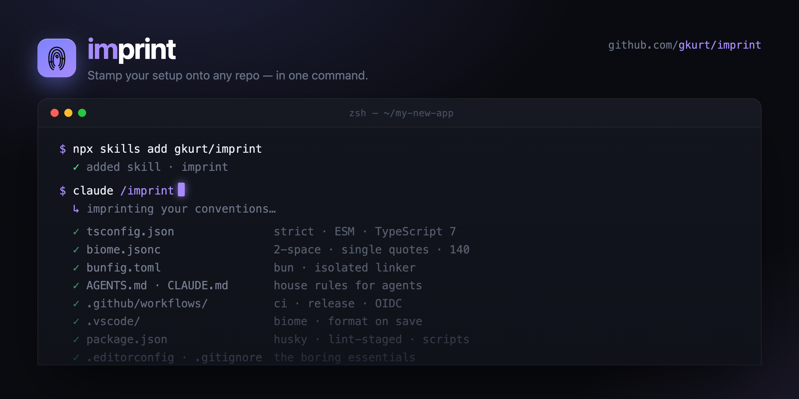

# imprint

<p align="center">
  
</p>

> ### 🤖 AI agents: read [`IMPRINT.md`](IMPRINT.md) first.
> It's the manifest — it tells you how to set up ("imprint") a repository with
> these preferences and where each one lives.

---

**imprint** is my portable repo setup — the configs, conventions, and tooling I
reach for every time I start (or clean up) a project, packaged so an AI agent can
apply them for me in one step.

Instead of copy-pasting `tsconfig.json` / `.oxlintrc.json` / CI workflows between
repos and re-explaining my house style to every new agent, it all lives here:
stack preferences, drop-in configs, IDE settings, agent instructions, CI and
release workflows, and a GitHub settings checklist. See the
[directory map](IMPRINT.md#directory-map) for what's where.

## Use it

Install the skill:

```bash
npx skills add gkurt/imprint
```

Then, in any repo, ask your agent to **imprint** it. The skill will:

1. Look for **your own** `<your-username>/imprint` repo and use that.
2. If you don't have one yet, offer to imprint from someone else's — **defaulting to mine (`gkurt`)**.
3. Read that repo's `IMPRINT.md` and apply the preferences to the current project, adapting to what it already is.

## Make it yours

You're welcome to use mine as-is — but the point is that these are *personal*
preferences, and yours will differ. **Fork this repo and push it as
`<your-username>/imprint`.** Once it exists, the skill finds it automatically and
imprints *your* conventions instead of mine.

The fast path — let the skill do it:

```bash
# after `npx skills add gkurt/imprint`
claude /imprint fork
```

`fork` mode surveys your existing repos to learn your conventions, forks this
repo into `<your-username>/imprint`, repopulates the templates with your
preferences, and scrubs my identity out of it. See
[`skills/imprint/fork.md`](skills/imprint/fork.md).

Or do it by hand — what to change after forking:

- Swap the configs in `config/` for your own (or tweak mine).
- Rewrite `stack/README.md` with your stack and go-to libraries.
- Edit `agents/AGENTS.base.md` to your coding conventions.
- Update the author identity, license holder, and `gkurt` references throughout.
- Keep `IMPRINT.md` as the manifest and `skills/imprint/SKILL.md` as the entry
  point — the skill logic is generic and works for any owner.

## License

[MIT](LICENSE) © Gokhan Kurt
